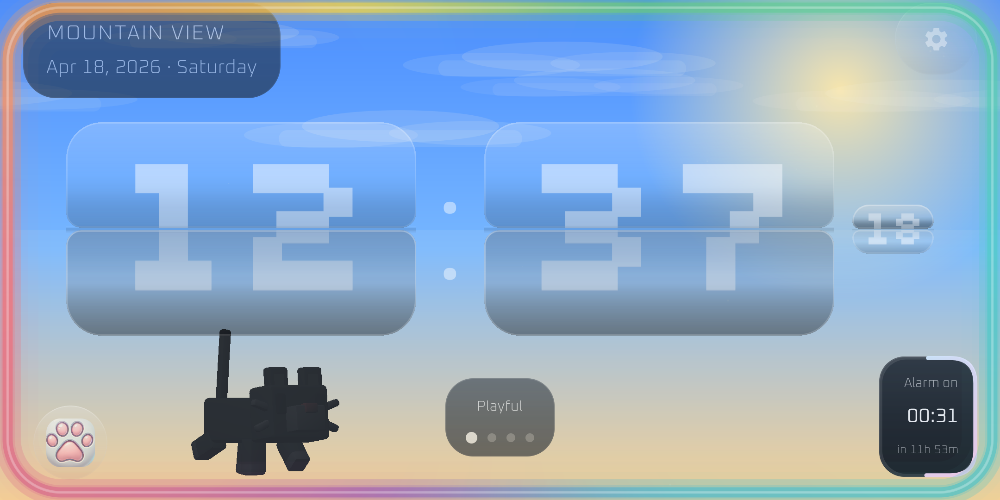

# MeowTime

MeowTime is a full-screen ambient clock for Android, built with Kotlin and Jetpack Compose. It is tuned for always-on desk use on Android 9+ devices, including phones without reliable Google Play Services. The app combines a liquid-glass split-flap clock, Pomodoro/countdown/stopwatch modes, weather particles, ambient sounds, daily alarms, edge lighting, and a small Filament cat companion.

## App Screenshot



## Current Features

1. Liquid-glass clock UI: translucent panels, neumorphic depth, soft snowy-night backgrounds, and large full-screen time layouts for landscape and portrait.
2. Mechanical split-flap digits: hour, minute, and second tiles use hinge lines, upper/lower clipping, layered shadows, and tuned sizing per font.
3. Four clock modes: `Clock`, `Pomodoro`, `Countdown`, and `Stopwatch` with swipe-based mode switching and compact mode indicators.
4. Pomodoro and countdown controls: iOS-style wheel duration pickers, start/reset controls, and a breathing circular timer control while running.
5. Stopwatch mode: live elapsed time with automatic focus/break reminder edge lighting every 30 minutes.
6. Daily alarm: inline settings, wheel-style time picker, home-screen alarm indicator, 10-minute snooze, and a large alarm dialog with `Snooze` and `Turn Off` actions.
7. Alarm progress indicator: the small home-screen alarm card shows the next alarm or active snooze countdown with a border progress ring.
8. Hourly chime: optional time signal for full-hour reminders.
9. Ambient sound: selectable rain or white noise for sleep/focus, with a one-hour auto-stop countdown.
10. Theme presets: `Auto`, `Focus`, `Playful`, `Serene`, and `Night` tune the visual mood, weather tendency, and ambient behavior.
11. Always-on weather particle system: rain, snow, hail, wind, drizzle, blizzard, fog, clouds, and night atmospheres render behind the clock.
12. Weather control: manual weather selection or auto-random rotation every 8 hours, with night quiet hours avoiding bright weather unless the user manually chooses it.
13. Edge light system: fixed full-screen border lighting with flowing color, ambient theme modes, stopwatch activity, break reminders, and stronger timer/alarm alert states.
14. Realtime cat companion: Filament + TextureView rendering with one grey low-poly cat that walks around the empty screen area and avoids covering the main clock.
15. Weather-linked cat behavior: the cat reacts differently to rain, snow, wind, hail, and calm weather.
16. Burn-in protection: always-on micro-shift and opacity behavior for long-running display use.
17. Location and date display: lightweight glass information card for city/date/weekday, with device location first and HTTPS IP fallback.
18. Battery indicator: subtle top-right battery percentage and icon.
19. Local font bundle: Google-font-based clock fonts are packaged in-app, so the UI does not depend on online font loading or Google Play Services.
20. Persistent settings: user choices are stored with DataStore Preferences.
21. Chinese resources: Simplified Chinese strings are included under `values-zh-rCN`.

## Modes

- `Clock`: ambient full-screen time display with date, location, theme, weather particles, cat, and alarm indicator.
- `Pomodoro`: focus/break timer with configurable focus and break lengths, progress display, completion alert, and cat feedback.
- `Countdown`: configurable countdown timer with completion alert and alarm-style visual feedback.
- `Stopwatch`: elapsed-time tracking with automatic 30-minute break reminder edge lighting.

## Visual System

- Liquid glass panels use layered transparency, soft borders, and dark blue/grey night tones.
- Flip tiles are calibrated separately for landscape and portrait so the clock remains the visual center.
- Edge lighting is always available as a theme layer and becomes more prominent for alerts.
- Weather particles stay behind the main clock and do not require network weather APIs.
- The cat layer is rendered below the time digits so it cannot obscure the clock.

## Fonts

The current packaged fonts are local replacements based on Google Fonts:

- `Modern`: Oxanium
- `Style 1`: Aldrich
- `Digital`: Orbitron
- `Pixel`: Silkscreen

They are bundled under `app/src/main/res/font/` for consistent rendering on devices without reliable Google font-provider support.

## Tech Stack

- Kotlin
- Jetpack Compose + Material 3
- Android ViewModel + StateFlow
- DataStore Preferences
- Filament (`filament-android`, `gltfio-android`, `filament-utils-android`)
- TextureView-based transparent 3D overlay
- Core library desugaring for Java time compatibility on API 24+
- Local audio, font, and model assets

## Build & Test

```bash
./gradlew :app:assembleDebug
./gradlew :app:installDebug
./gradlew :app:testDebugUnitTest
```

## Release

- Current app version: `1.1`
- Latest GitHub release: [v1.1](https://github.com/zhcc-b/meowtime/releases/tag/v1.1)
